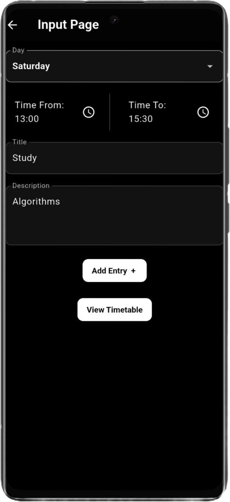
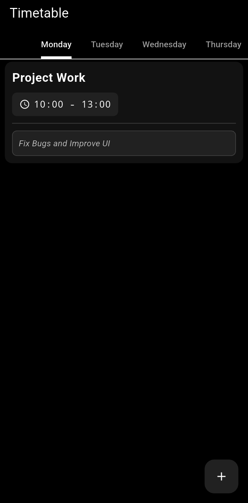

# Timetable App - Flutter

A **Flutter-based timetable app** designed to help users manage their daily schedules efficiently. The app allows users to **add, view, edit, and delete timetable entries** with details such as day, time, title, and description. It features a **user-friendly interface** with a **dark theme**, **slidable tabs for each day of the week**, and **persistent local storage** using Hive.

---

## **Key Features**
- **Add Timetable Entries**: Input tasks with day, time, title, and description.
- **View Entries**: Organize tasks by day using slidable tabs.
- **Edit Entries**: Modify existing tasks with ease.
- **Delete Entries**: Easily remove tasks with a delete button.
- **Dark Theme**: AMOLED black theme for a sleek and modern look.
- **Local Storage**: Data is stored locally using Hive for offline access.
- **Real-Time Updates**: Automatically updates the UI when data changes.
- **Countdown to Next Event**: Shows the time remaining for the next event.
- **Slide Actions**: Swipe to edit or delete entries.

---

## **Technologies Used**
- **Flutter**: For cross-platform app development.
- **Hive**: For lightweight and efficient local storage.
- **Material Design**: For a clean and intuitive UI.
- **Flutter Slidable**: For swipe-to-edit and delete functionality.

---

## **Screenshots**
<!-- Add screenshots here -->
|  |  |
|--------------------------------------|------------------------------------------|
| **Input Page**                       | **Display Page**                         |

---

## **How to Use**
1. Clone the repository:
   ```bash
   git clone https://github.com/your-username/timetable-app.git
Navigate to the project directory:

bash
Copy
cd timetable-app
Install dependencies:

bash
Copy
flutter pub get
Run the app:

bash
Copy
flutter run
Folder Structure
Copy
timetable-app/
├── lib/
│   ├── main.dart              # Entry point of the app
│   ├── input.dart             # Input page for adding entries
│   ├── display.dart           # Display page for viewing entries
│   ├── timetable_entry.dart   # Hive model for timetable entries
│   └── edit_entry.dart        # Edit page for modifying entries
├── android/                   # Android-specific files
├── ios/                       # iOS-specific files
├── assets/                    # Assets like images, fonts, etc.
└── pubspec.yaml               # Flutter dependencies and metadata
Contributing
Contributions are welcome! Please follow these steps:

Fork the repository.

Create a new branch:

bash
Copy
git checkout -b feature/your-feature-name
Commit your changes:

bash
Copy
git commit -m "Add your message here"
Push to the branch:


git push origin feature/your-feature-name
Open a pull request.

License
This project is licensed under the MIT License. See the LICENSE file for details.

Acknowledgements
Flutter for the amazing framework.

Hive for lightweight local storage.

Flutter Slidable for swipe actions.

Contact
For any questions or feedback, feel free to reach out:

Email: omeshapasan@gmail.com

GitHub: omeshapasan2